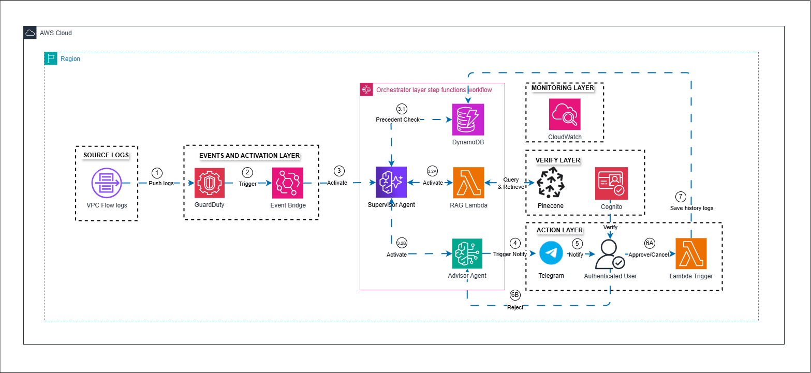

# PROJECT OUTLINE: CLOUD-SENTINEL
**Automated Multi-tier Security Monitoring and Response System**

---

## 1. PROJECT OVERVIEW

* **Objective:** To build a fully automated system for detecting, analyzing, and responding to security threats on cloud infrastructure by combining the reasoning power of AI (via LLMs) with a modern Serverless architecture.
* **Problem Statement:** * Shift the security operations workflow from manual to automated to reduce the burden on administrators.
    * Eliminate false positives through a cross-validation process between AI Agents.
    * Provide real-time incident analysis and automatically execute protective actions following human expert verification.

---

## 2. SYSTEM ARCHITECTURE

The system is designed entirely on AWS and deployed in the Asia Pacific (Singapore) region. The architecture is divided into 5 specialized layers following the diagram's workflow:

### 2.1. Source Logs + Events and Activation Layer
* **VPC Flow Logs:** Acts as the infrastructure data source, capturing all network traffic logs.
* **Amazon GuardDuty:** Directly analyzes data from EC2 VPC Flow Logs. This process begins by pushing log data into the system (Step 1: Push logs).
* **Amazon EventBridge:** Serves as the activation bridge (Step 2: Trigger). It processes data with an estimated payload size of 2 KB to initiate the analysis workflow.

### 2.2. Orchestrator Layer
Housed within **AWS Step Functions**, this layer manages the sequence of Agent actions. The system is configured to handle an estimated 100 workflow requests per month. Each workflow performs an average of 40 state transitions.
* **Supervisor Agent:** Receives the initialization request from EventBridge (Step 3: Activate) and acts as the "brain" coordinating subsequent actions.
* **Precedent Check (DynamoDB):** The Supervisor Agent queries DynamoDB (Step 3.1) to check if the anomaly has a resolved precedent, optimizing processing time and costs.
* **RAG Lambda:** If additional knowledge is required, the Supervisor Agent triggers an AWS Lambda function (Step 3.2A). The Lambda service is allocated 512 MB of ephemeral storage and runs on an x86 architecture.
* **Advisor Agent:** Once sufficient context is gathered, the Supervisor Agent activates the Advisor Agent (Step 3.2B) to synthesize the situation and provide recommendations. The analytical power of these Agents is supported by Amazon Bedrock.

### 2.3. Verify Layer
* **Pinecone:** Operates as a Vector Database for the RAG Lambda's data queries (Query & Retrieve).
* **Amazon Cognito:** Manages the administrator authentication process before they are permitted to make decisions. This service is configured for 800 monthly active users (MAU).

### 2.4. Action Layer
* **Telegram:** The Advisor Agent triggers an alert (Step 4: Trigger Notify). A notification containing detailed analysis is sent to the administrator via Telegram (Step 5: Notify).
* **Approval Process (Authenticated User):** The authenticated security professional makes a decision:
    * **Approve/Cancel (Step 6A):** Approves the response script, directly triggering the **Lambda Trigger** block to isolate the threat or apply a fix.
    * **Reject (Step 6B):** Rejects the proposal, returning the cycle for re-analysis or cancellation.
* **Log Retention (Step 7: Save history logs):** After an action is executed, the Lambda Trigger saves the incident history into the database as a precedent for future events.

### 2.5. Monitoring Layer
* **Amazon CloudWatch:** Monitors the overall operational health of the entire architecture. The setup includes 1 Dashboard, 10 custom Metrics, and 5 Standard Resolution Alarm Metrics.

---

## 3. CORE DATA FLOW

1. **Ingestion & Detection:** Traffic from **VPC Flow Logs** is sent to **GuardDuty**.
2. **Activation:** Upon detecting an anomaly, **GuardDuty** sends a signal to **Event Bridge**, triggering the **Step Functions** workflow.
3. **Orchestration & Reasoning:**
    * The **Supervisor Agent** queries **DynamoDB** to check for precedents.
    * If more knowledge is needed, it queries the **RAG Lambda** paired with the **Pinecone** vector database.
    * The **Advisor Agent** proposes a remediation plan based on the gathered data.
4. **Alerting:** The alert is routed via **Telegram** to the security professional's system.
5. **Remediation:** The professional logs in via **Cognito**, reviews the analysis, and hits "Approve" for the **Lambda Trigger** to execute the automated fix and save the system log.

---

## 4. OPERATIONAL COST ESTIMATE

[📄 View detailed AWS Cost Estimate (PDF)](./Estimate_Costs.pdf)

This is the estimated cost exported on 03/26/2026 for the Asia Pacific (Singapore) deployment region.

* **Total Estimated Monthly Cost:** 14.46 USD.
* **Total Estimated 12-Month Cost:** 173.52 USD.

**Paid Services Breakdown:**
* **Amazon GuardDuty:** 6.90 USD/month for 6 GB of EC2 VPC Flow Log analysis.
* **Amazon Bedrock:** 3.78 USD/month (On Demand - Standard). Estimated 600 input tokens and 300 output tokens per request.
* **Amazon CloudWatch:** 3.50 USD/month (Includes 1 Dashboard, 10 Metrics, 5 Alarms).
* **Amazon DynamoDB:** 0.28 USD/month (1 GB data storage, average item size 10 KB).

**Budget-Optimized Services (0.00 USD/month):**
* Amazon EventBridge, AWS Step Functions, AWS Lambda, and Amazon Cognito are estimated at 0.00 USD/month based on the system's limited usage configuration.