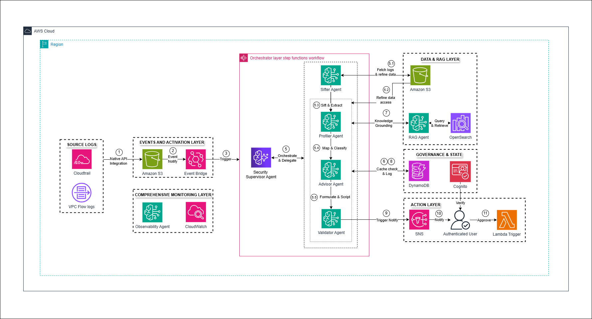

# PROJECT OUTLINE: CLOUD-SENTINEL
**Hệ thống Giám sát và Phản ứng Bảo mật đa tầng dựa trên kiến trúc Đa tác nhân AI**

---

## 1. TỔNG QUAN DỰ ÁN 

* **Mục tiêu:** Xây dựng hệ thống tự động hóa phát hiện, phân tích và phản ứng với các mối đe dọa bảo mật trên hạ tầng điện toán đám mây bằng cách phối hợp các Agent AI chuyên biệt thông qua mô hình Multi-Agent Orchestration.
* **Vấn đề giải quyết:** 
    * Giảm tải áp lực cho đội ngũ SOC.
    * Hạn chế tối đa báo động giả thông qua kiểm chứng đa tầng.
    * Rút ngắn thời gian phản ứng với mối đe dọa bằng quy trình phản ứng tự động.

## 2. KIẾN TRÚC HỆ THỐNG 

Kiến trúc được thiết kế theo mô hình Serverless, chia thành 5 lớp chức năng chính được quản lý tập trung:

### 2.1. Lớp dữ liệu nguồn & Kích hoạt (Source Logs + Event & Activation Layer)
* **Data Sources:** 
    * **AWS CloudTrail:** Ghi lại toàn bộ lịch sử hoạt động API của tài khoản.
    * **VPC Flow Logs:** Giám sát lưu lượng IP đi qua các giao diện mạng trong VPC.
* **Cơ chế kích hoạt:** 
    * **Native API Integration:** CloudTrail tích hợp trực tiếp với EventBridge để phản ứng theo thời gian thực với các hành vi thay đổi cấu hình trái phép.
    * **S3 Event Notification:** Kích hoạt luồng phân tích khi các tệp log lớn được đẩy vào S3 Bucket.

### 2.2. Lớp Điều phối (Orchestrator Layer)
Nằm trong khung quản lý của **AWS Step Functions**, đảm bảo tính nhất quán và khả năng phục hồi của quy trình.

* **Security Supervisor Agent:** "Bộ não" trung tâm tiếp nhận yêu cầu, lập kế hoạch thực thi và điều phối 4 tác tử chuyên gia:
* **Agent 1 (The Sifter Agent):** Truy xuất log thô từ S3, thực hiện sàng lọc và ghi lại "Dữ liệu tinh lọc" (Refined Data) trở lại S3 nhằm tối ưu chi phí Token cho các bước sau.
* **Agent 2 (The Profiler Agent):** Đọc dữ liệu tinh lọc, đối chiếu hành vi với khung tấn công **MITRE ATT&CK** để định danh loại hình đe dọa.
* **Agent 3 (The Advisor Agent):** Tham chiếu các Best Practices (NIST, CIS) để đề xuất kịch bản khắc phục (Remediation) phù hợp.
* **Agent 4 (The Validator Agent):** Thực hiện kiểm chứng chéo cuối cùng, đảm bảo tính xác thực của thông tin trước khi phát báo động.

### 2.3. Lớp Tri thức & Quản trị  (Data & RAG + Governance & State Layer)
* **Agentic RAG Layer:** Kết hợp Amazon S3 (Data Storage) và OpenSearch (Vector Database) để cung cấp tri thức chuyên sâu và ngữ cảnh thực tế cho các Agent trong quá trình suy luận.
* **Semantic Caching (DynamoDB):** 
    * Lưu trữ dấu vết tư duy và kết quả phân tích của Agent.
    * Thực hiện cơ chế **Cache Lookup**: Các agent kiểm tra sự cố tương tự đã có tiền lệ chưa để giảm tải cho RAG và tối ưu chi phí vận hành.

### 2.4. Lớp Phản ứng (Action Layer)
* **Amazon SNS:** Phát báo động tức thời qua Email, SMS.
* **Admin Approval Dashboard:** Tích hợp **Amazon Cognito** để xác thực chuyên viên bảo mật, cho phép phê duyệt hoặc từ chối các hành động khắc phục trực tiếp từ Dashboard.
* **Lambda:** Thực thi lệnh chặn IP, thu hồi quyền truy cập IAM hoặc cô lập tài nguyên bị xâm nhập sau khi có sự xác nhận của con người.

### 2.5. Lớp Giám sát Toàn diện (Comprehensive Monitoring Layer)
* **Amazon CloudWatch**: Giám sát "sức khỏe" vận hành của toàn bộ hệ thống AI, bao gồm nhật ký thực thi của Lambda, trạng thái Step Functions và độ trễ của API.

* **Observability Agent**: Theo dõi hiệu suất của từng Agent, mức tiêu thụ Token và lưu lượng xử lý để đảm bảo hệ thống luôn sẵn sàng và có khả năng kiểm toán.

## 3. LUỒNG DỮ LIỆU CHÍNH

1.  **Ingestion:** Logs được đẩy vào S3 $\rightarrow$ EventBridge $\rightarrow$ Kích hoạt Step Functions điều phối.
2.  **Sifting:** **Agent 1** fetch log thô từ S3 $\rightarrow$ Lọc nhiễu $\rightarrow$ Ghi metadata tinh lọc vào S3.
3.  **Reasoning (Cache-First):** 
    * **Agent 2, 3, 4** truy xuất dữ liệu tinh lọc từ S3.
    * Đối chiếu với **DynamoDB (Cache)**: Nếu có sẵn kết quả → Bỏ qua bước RAG.
    * Nếu Cache-miss → truy vấn **Agentic RAG** để lấy tri thức → cập nhật lại Cache.
4.  **Verification & Reporting:** **Agent 4** tổng hợp kết quả → Gửi báo cáo đã xác thực tới **SNS**.
5.  **Remediation:** Admin phê duyệt → **Lambda** thực hiện ngăn chặn sự cố ngay lập tức.

## 4. ĐÁNH GIÁ HIỆU QUẢ 
* **Performance:** Xử lý và đưa ra quyết định phản ứng trong thời gian ngắn.
* **Accuracy:** Giảm thiểu báo động giả nhờ quy trình xác thực đa lớp và tri thức nền tảng từ RAG.
* **Cost Efficiency:** Tối ưu hóa chi phí LLM nhờ cơ chế **Sifting** và **Semantic Caching**.
* **Scalability:** Kiến trúc **Serverless** cho phép hệ thống tự động mở rộng theo lưu lượng log, hỗ trợ giám sát đa vùng và đa tài khoản.
